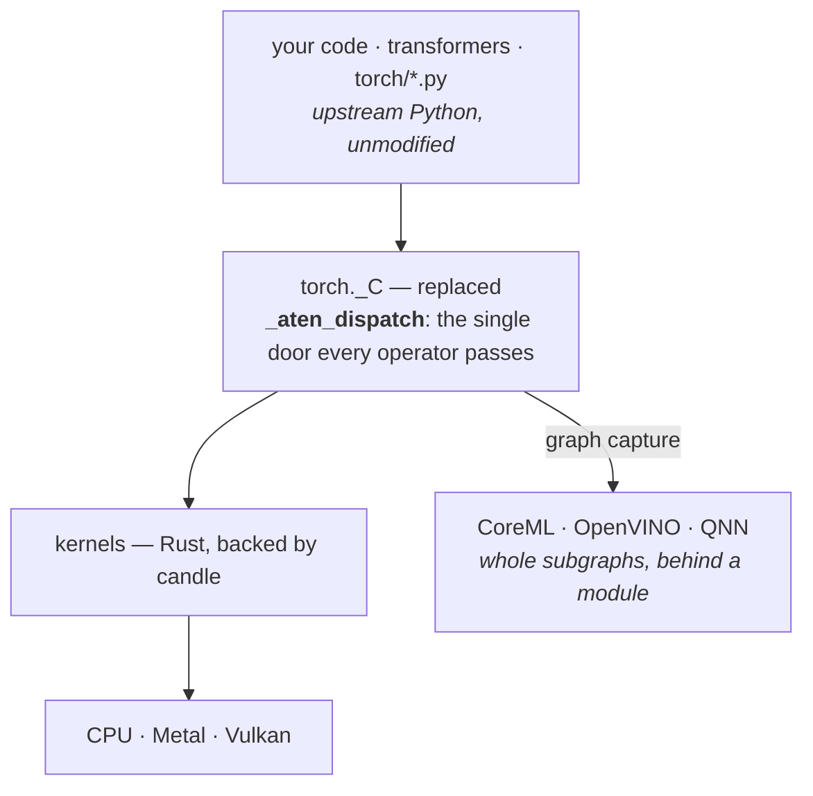

English | [한국어](docs/locale/README_ko.md)

<div align="center">

# torchnative

**Run the real PyTorch ecosystem on device — not a reimplementation of it.**

[](https://pypi.org/project/torchnative/)
[-blue)](https://www.python.org/)
[](LICENSE)
[](#%EF%B8%8F-platform-support)
[](#-status)

[Guide](https://thisisthepy.github.io/torchnative/) ·
[Status in detail](docs/platform/STATUS.md) ·
[Design](docs/design/DESIGN.md) ·
[한국어](docs/locale/README_ko.md)

</div>

---

`torchnative` replaces PyTorch's compiled core — `torch._C` — with a native Rust extension, so the
genuine `torch` and `transformers` packages run on a phone the way they run on a workstation.
Models are not ported, converted or re-expressed. **They are imported.**

```python
from transformers import AutoModelForCausalLM     # the real one
model = AutoModelForCausalLM.from_pretrained("...")
model.generate(...)                                # on the device
```

> [!WARNING]
> **Pre-alpha.** The operator layer agrees with upstream PyTorch numerically, real checkpoints load,
> `transformers` imports and generates, and Android runs the built artefact. But `torch.compile`
> is refused by design, CUDA has never run, the Intel NPU path has only been tested against a fake
> device, and of the nine build targets **two have never been executed anywhere** (Windows arm64,
> iOS device) while one refuses to build (Android x86_64). Read [Status](#-status) before
> depending on it.

---

## 💡 Why not a reimplementation

Every other route to on-device inference re-expresses the model somewhere else.

| | approach | cost |
|---|---|---|
| llama.cpp | architectures rewritten in C++ | each new architecture is a porting task |
| ExecuTorch · CoreML | ahead-of-time compiled graph | an export step, and what runs is not what you wrote |
| MLC | lowered to its own runtime | same |
| **torchnative** | **the real Python package** | **the substrate is hard; architectures are free** |

Nobody runs the real thing because `torch._C` cannot be built for mobile: PyTorch's build sets
`INTERN_BUILD_MOBILE` for any Android or iOS toolchain, and that path forces `BUILD_PYTHON` off.
`torchnative` supplies that one module. **Everything above it is upstream source, unmodified.**

---

## ✨ Features

- 🤖 **LLM inference with real `transformers`** — `from_pretrained` loads bit-identical weights,
  `generate` emits upstream's tokens in `float32`, and streaming works across threads.
- 🎯 **Agreement, not just reachability** — 302 ATen operators compared against upstream;
  297 of 297 swept architectures forward and 284 of 285 judgeable ones agree numerically, at a
  tolerance *derived* from upstream's own float32 error.
- 🔁 **Test-time adaptation** — `adapt.wrap(model, method=adapt.Tent())` adapts in place; a weight
  delta over the base reverts **bit-identically**.
- 🌐 **Federated learning on `torch.distributed`** — FedAvg across processes equals the same
  average computed centrally, element for element.
- ⚡ **Accelerators without silent fallback** — Metal and Vulkan compute on the real GPU, a CoreML
  graph runs on the Apple Neural Engine, and anything that would fall back to the host refuses by
  name instead.
- 🧩 **NPUs by module replacement** — `model.to(torchnative.device.npu)` lowers leaves for the
  host's NPU and hands back the **same `nn.Module`**, so it still trains and still generates.
- 📦 **One wheel per platform** — `cp313-abi3`, so one binary loads on CPython 3.13 and later.

---

## 🚀 Quick start

```sh
pip install --pre torchnative
```

Stream tokens from a real Hugging Face model:

```python
import torch
from threading import Thread
from transformers import AutoModelForCausalLM, AutoTokenizer, TextIteratorStreamer

name  = "HuggingFaceTB/SmolLM2-135M"
model = AutoModelForCausalLM.from_pretrained(name, dtype=torch.float32)
tok   = AutoTokenizer.from_pretrained(name)

streamer = TextIteratorStreamer(tok, skip_prompt=True, skip_special_tokens=True)
inputs   = tok("On-device inference is", return_tensors="pt")

Thread(target=model.generate, kwargs=dict(**inputs, max_new_tokens=32, streamer=streamer)).start()

for piece in streamer:          # yields as the model decodes
    print(piece, end="", flush=True)
```

On an M-series desktop the first token arrives in **34 ms**, then **47 tokens/s**. In `float32`
the tokens are the ones upstream emits; in `bfloat16` they diverge, because upstream disagrees with
*itself* under a change of accumulation order.

Adapt at test time, then put the base weights back:

```python
from torchnative import adapt

model = adapt.wrap(model, method=adapt.Tent(), lr=1e-3)
model.online()                                   # adapt as it serves
model.revert()                                   # the base weights are back, byte for byte
```

Send it to the NPU without giving up the module:

```python
from torchnative import device

model.to(device.npu)   # resolves the host's NPU, lowers what it can, returns the same nn.Module;
                       # a UserWarning names anything that stayed on the CPU
```

More task pages are in the [guide](https://thisisthepy.github.io/torchnative/).

---

## 🧩 How it works



- **One door.** Every operator reaches its kernel through `_aten_dispatch`, and nothing bypasses it.
  An unimplemented operator names itself instead of failing downstream, and graph capture has
  exactly one place to attach.
- **Fixed front end, swapped back end.** The user keeps the real `transformers` model; an NPU back
  end replaces leaves or submodules in place, and a vendor blob is never something you hold.
- **Refuse by name.** What is not supported says so, with the reason. A silent CPU fallback is
  made unrepresentable rather than merely avoided.
- **Stable ABI.** Built against CPython's limited API (`abi3-py313`): one binary per platform.

---

## 📊 Status

Every number below has a run behind it. The long form, with the measurement and caveat for every
row, is [`docs/platform/STATUS.md`](docs/platform/STATUS.md).

| | |
|---|---|
| ATen operators | **302**, each compared against upstream |
| Golden comparison cases | **11,420 / 11,420** — values, shapes, dtypes, through the door and through the member |
| Smoke tests | **480** in `test_shim.py` alone; the gate runs every suite in `tests/` |
| Signature and schema tables | **5,024 of 5,037** entries checked against upstream |
| Architectures — forward | **297 of 297** swept (reachability; not a fresh full sweep — see the long form) |
| Architectures — agree with upstream | **284 of 285** judgeable, at a derived tolerance ([`AGREE.md`](docs/numerics/AGREE.md)) |
| Training | `loss.backward()` through upstream's own autograd path, matching upstream to one float32 ulp |
| Test-time adaptation | `Tent` on SmolLM2-135M: entropy **4.1604 → 2.9828**, revert bit-identical ([`ADAPT.md`](docs/models/ADAPT.md)) |
| `torch.distributed` | **eleven collectives** agree with upstream gloo at world 3 and 4 ([`COLLECT2.md`](docs/distributed/COLLECT2.md)) |
| Accelerators | Metal and Vulkan compute on the real GPU; CoreML runs on the Neural Engine; NNAPI executes on the CPU reference driver only ([`NPU2.md`](docs/graph/NPU2.md)) |
| Not working | `torch.compile` (refused permanently — [`COMPILE.md`](docs/graph/COMPILE.md)), CUDA never run, Intel NPU never run on hardware |

<!-- DOCWATCH: count golden_ops_covered ge 302 -->
<!-- DOCWATCH: count golden_cases_total ge 11420 -->
<!-- DOCWATCH: count golden_cases_passed ge 11420 -->
<!-- DOCWATCH: count golden_cases_failed eq 0 -->
<!-- DOCWATCH: count golden_pending eq 0 -->
<!-- DOCWATCH: count smoke_ok ge 480 -->
<!-- DOCWATCH: count schema_entries_matched ge 5024 -->
<!-- DOCWATCH: count schema_entries_total ge 5037 -->
<!-- DOCWATCH: symbol-in-file docs/architectures/ARCH300.md 290 present -->
<!-- DOCWATCH: symbol-in-file docs/architectures/ARCH300.md 297 present -->
<!-- DOCWATCH: symbol-in-file docs/architectures/ARCH300.md 7 present -->
<!-- DOCWATCH: symbol-in-file docs/architectures/ARCH300.md 6 present -->
<!-- DOCWATCH: symbol-in-file docs/numerics/AGREE.md 284 present -->
<!-- DOCWATCH: symbol-in-file docs/numerics/AGREE.md 285 present -->
<!-- DOCWATCH: symbol-in-file tests/test_agree.py test_the_report_cannot_count_an_unjudgeable_architecture_as_agreeing present -->
<!-- DOCWATCH: symbol-in-file tests/test_agree.py test_the_oracle_factor_is_stated_and_is_not_a_free_parameter present -->
<!-- DOCWATCH: symbol-in-file tests/test_shim.py test_a_real_training_loop_runs_through_loss_backward_and_agrees_with_upstream present -->
<!-- DOCWATCH: op-implemented aten.native_batch_norm.default -->
<!-- DOCWATCH: symbol-in-file crates/torch_c/src/device.rs _shim_mps_host_readback_ops present -->
<!-- DOCWATCH: symbol-in-file crates/torch_c/src/bootstrap.py ProcessGroupLocal present -->

---

## 🖥️ Platform support

**Legend** — ✅ measured working · ❌ measured refusing · ⚠️ built, never executed ·
🔲 not built · — not applicable to that platform

| | macOS<br>arm64 | Android<br>arm64 | Android<br>x86_64 | iOS sim<br>arm64 | iOS device<br>arm64 | Linux<br>x86_64 | Linux<br>aarch64 | Windows<br>x86_64 | Windows<br>arm64 | WASM |
|---|:--:|:--:|:--:|:--:|:--:|:--:|:--:|:--:|:--:|:--:|
| in the target matrix | ✅ | ✅ | ✅ *listed, refuses* | ✅ | ✅ | ✅ | ✅ | ✅ | ✅ | — *deliberately* |
| rust target installed | ✅ | ✅ | ✅ | ✅ | ✅ | ✅ | ✅ | ✅ | ✅ | ✅ |
| target CPython | ✅ | ✅ | ❌ *none exists, none downloadable* | ✅ | ✅ | ✅ | ✅ *PBS `20260825`* | ✅ | ✅ *PBS `20260825`* | ✅ *Pyodide 3.14* |
| candle builds | ✅ | ✅ | 🔲 | ✅ | ✅ | ✅ | ✅ | ✅ | ✅ | ✅ |
| candle **computes** | ✅ | ✅ | 🔲 | ✅ | ⚠️ | ✅ *CI* | ✅ *here* | ✅ *CI* | ⚠️ | ✅ *under Node* |
| CUDA extension **builds** | — | — | — | — | — | 🔲 *CI job written, never run* | 🔲 *not targeted* | 🔲 | — | — |
| CUDA **computes** | — | — | — | — | — | ⚠️ | 🔲 *not targeted* | ⚠️ | — | — |
| extension builds | ✅ | ✅ | 🔲 | ✅ | ✅ | ✅ *`cargo-zigbuild`* | ✅ *`cargo-zigbuild`* | ✅ *`cargo-xwin`* | ✅ *`cargo-xwin`* | ✅ *emscripten* |
| wheel builds | ✅ | ✅ | ❌ *refuses by name* | ✅ | ✅ | ✅ *`manylinux_2_17_x86_64`* | ✅ *`manylinux_2_17_aarch64`* | ✅ *`win_amd64`* | ✅ *`win_arm64`* | ⚠️ *by hand, not by `build.py`* |
| symbols resolve | ✅ | ✅ | — | ✅ | ✅ *118 names against the device framework* | ⚠️ *weaker: ELF names only versioned imports* | ⚠️ *same* | ✅ *PE names every one* | ✅ *PE names every one* | ✅ *stub behaviour proven against the real host* |
| `dlopen` + `PyInit_` runs | — | — | — | — | — | — | — | — | — | ✅ |
| installs | ✅ | ✅ | — | ✅ | ⚠️ | ✅ | ✅ *pip matched the tag on real aarch64 Linux* | ✅ | ⚠️ | ✅ *mounted, no wheel* |
| `import torch` | ✅ | ✅ | — | ✅ | ⚠️ | ✅ | ✅ | ✅ | ⚠️ | ✅ |
| computes | ✅ | ✅ | — | ✅ | ⚠️ | ✅ | ✅ *glibc 2.17 **and** modern* | ✅ | ⚠️ | ✅ |
| **on PyPI `0.1.0b0`** | ✅ | ✅ | 🔲 *refuses* | ✅ | ✅ | ✅ | ✅ *first published here* | ✅ | ✅ *first published here* | ✅ |
| can be run *here* | ✅ | emulator | ❌ *no x86-64 emulator on Apple Silicon* | simulator | ❌ | CI | ✅ *Docker, native aarch64* | CI | ❌ | ✅ *Node* |

| device | macOS | Android | iOS | Linux | Windows | WASM | what it is |
|---|:--:|:--:|:--:|:--:|:--:|:--:|---|
| `cpu` | ✅ | ✅ | ⚠️ | ⚠️ | ⚠️ | ✅ | the only device that holds a tensor |
| `meta` | ✅ | ✅ | ⚠️ | ⚠️ | ⚠️ | 🔲 | shape and dtype, no storage |
| `mps` | ✅ | — | 🔲 | — | — | — | candle's Metal backend, on. An op whose kernel would compute on the **CPU under an `mps` label** is refused at the door, naming the op — **99** of them (this cell said 54), listed at runtime by `_C._shim_mps_host_readback_ops()`. A transformer forwards here ([`MPSATTN.md`](docs/devices/MPSATTN.md)) |
| `vulkan` | ✅ | ❌ | — | 🔲 | 🔲 | — | thirty-one ops through real `VkBuffer`s; a pretrained BERT forwards and agrees with upstream ([`VULKAN7.md`](docs/devices/VULKAN7.md)) |
| NNAPI · CoreML | ✅ *CoreML* | ✅ *NNAPI* | 🔲 | — | — | — | both execute; CoreML reaches the Neural Engine, NNAPI has met only a CPU driver |
| `cuda` | — | — | — | ⚠️ | ⚠️ | — | wired, never compiled or run ([`CUDA.md`](docs/devices/CUDA.md)) |

The dtype and quantisation matrices, and the reasoning behind every cell, are in
[`docs/platform/STATUS.md`](docs/platform/STATUS.md#platform-support) and
[`docs/platform/WHEELMATRIX.md`](docs/platform/WHEELMATRIX.md).

---

## 🗺️ Roadmap

| | |
|---|---|
| ✅ Device abstraction | `torch.device` vocabulary, per-device dispatch, a `Repr` arm per device; `torchnative.device` with `cpu` · `mps` · `vulkan` · `cuda` · `npu` |
| ✅ `torchnative.transformers` | all 49 `Auto*` classes, enumerated from `transformers`, returning real models |
| 🟡 NPU back ends | Intel NPU wired through OpenVINO (no hardware has run it); Apple ANE and Hexagon refuse by name after resolving |
| 🟡 Eager training | backward and optimizer steps agree; double-backward, `autograd.Function` and hooks refuse |
| 🟡 Federated learning | multi-process FedAvg; no secure aggregation, privacy or participant selection |

> This table records what has been **measured**, not what is planned. **Last re-measured 2026-09-07**
> ([`docs/verification/REMEASURE2.md`](docs/verification/REMEASURE2.md)); where it disagrees with a
> `docs/` file, the file is the measurement and this is the summary.

**Planned, not measured:** kernel bundles that satisfy the Hugging Face `kernels` contract and
resolve at build time ([`DESIGN.md`](docs/design/DESIGN.md) §8). **Not on the roadmap:**
`torch.compile`, refused by name permanently — `torch.export` is the direction. The long-form
roadmap and the API it is heading for are in
[`docs/platform/STATUS.md`](docs/platform/STATUS.md#roadmap).

---

## 📦 Install

```sh
pip install --pre torchnative
```

Nine platform wheels, all `cp313-abi3`. Each carries the `_C` extension **and** the vendored
upstream tree, so `import torch` resolves to *this* build — it cannot coexist with an installed
PyTorch. `0.0.1a0` on PyPI is a broken `py3-none-any` skeleton; ask for `0.1.0b0` or later. There
is no sdist.

**Build from source** (Rust toolchain, CPython 3.13+):

```sh
bash scripts/vendor/vendor_torch.sh     # assemble the vendored torch tree
bash scripts/vendor/install_shim.sh     # build the extension and install it
python scripts/wheel/build.py                            # -> dist/*.whl
python scripts/wheel/verify.py dist/torchnative-*.whl    # clean venv, real import
```

Cross-compilation: [`docs/platform/RUST_CROSSBUILD.md`](docs/platform/RUST_CROSSBUILD.md).

---

## 🧪 Verification

Correctness here means *agreeing with upstream PyTorch*, so the strategy is comparison, not
assertion.

- **Golden comparison** — every operator runs on upstream torch and on this shim, compared on value,
  shape and dtype.
- **The harness tests itself** — `--self-test` injects plausible misimplementations into each
  comparator and fails if any is accepted.
- **Tokens are not enough** — a wrong `gelu` produced identical tokens with logits off by 5.9e-04,
  so end-to-end tests compare logits too.
- **Documentation is checked** — DOCWATCH markers tie the numbers on this page to live runs.

```sh
bash tests/run.sh                # the gate
python tests/golden/compare.py                  # golden comparison against upstream
```

---

## 📖 Documentation

- 🌐 **[Guide](https://thisisthepy.github.io/torchnative/)** — getting started, concepts, task
  guides, English and Korean (source in [`docs/guide/`](docs/guide/index.html))
- 📊 **[Status in detail](docs/platform/STATUS.md)** — every measurement and caveat behind the tables above
- 🏛️ **[Design](docs/design/DESIGN.md)** — why only `torch._C`, and the decisions that constrain the rest
- 🇰🇷 **[한국어 README](docs/locale/README_ko.md)**

`docs/` records what was measured, what was assumed, and where an earlier conclusion turned out to
be wrong — corrections are left visible rather than edited away.

## 🤝 Contributing

Work starts from an issue and lands through a pull request into `develop`; tests come first. The
[contributing page of the guide](https://thisisthepy.github.io/torchnative/contributing.html)
explains the workflow and the verification standard.

## 🔗 Ecosystem

- [PythonMultiplatform](https://github.com/thisisthepy/PythonMultiplatform) — embeds CPython 3.13
  in Kotlin Multiplatform; the deployment target for this library
- [pypackpack](https://github.com/thisisthepy/pypackpack) — the build and bundling tool
- [Hugging Face `kernels`](https://github.com/huggingface/kernels) — the fused-kernel contract this
  adopts, with resolution moved from runtime download to build time

## 📜 License

**Apache-2.0** — see [LICENSE](LICENSE).

The repository and the wheel carry different licences. This repository contains only this
project's code; the vendored PyTorch tree is assembled at build time and not redistributed here. A
**platform wheel** carries upstream PyTorch's entire Python tree with `torch._C` replaced, so most
of its files are upstream's, under upstream's terms — which is why `pyproject.toml`'s `license` is
torch 2.13.0's own `License-Expression`, verbatim:

```
Apache-2.0 AND Apache-2.0 WITH LLVM-exception AND BSD-2-Clause
AND BSD-3-Clause AND BSL-1.0 AND MIT
```

`scripts/wheel/build.py` ships torch's `dist-info`, third-party notices included.
