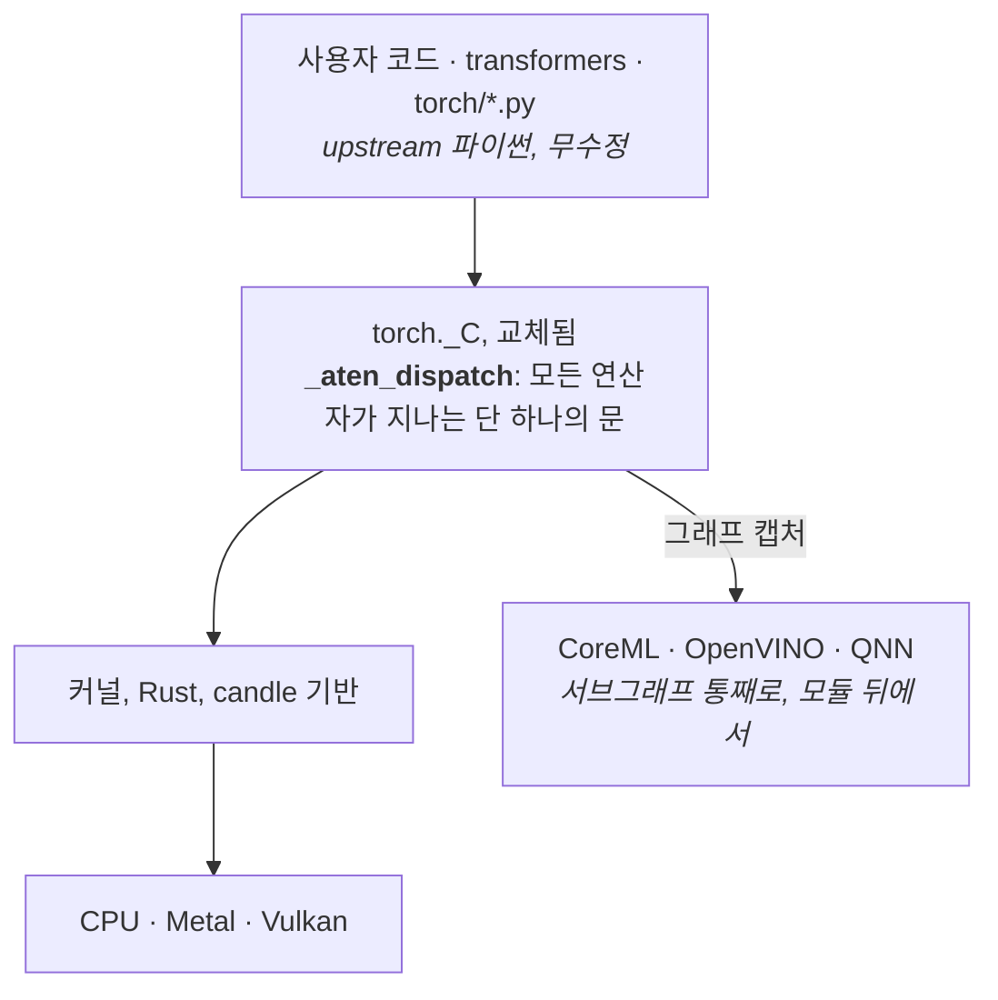

[English](../../README.md) | 한국어

<div align="center">

# torchnative

**진짜 PyTorch 생태계를 기기에서: 재구현이 아니라 그대로.**

[](https://pypi.org/project/torchnative/)
[-blue)](https://www.python.org/)
[](../../LICENSE)
[](#%EF%B8%8F-플랫폼-지원)
[](#-현황)

[가이드](https://thisisthepy.github.io/torchnative/) ·
[상세 현황](../platform/STATUS.md) ·
[설계](../design/DESIGN.md) ·
[English](../../README.md)

</div>

---

`torchnative` 는 PyTorch 의 컴파일된 핵심인 `torch._C` 를 Rust 네이티브 확장으로 교체해,
진짜 `torch` 와 `transformers` 패키지가 워크스테이션에서처럼 휴대폰에서 돌게 합니다.
모델을 포팅하거나 변환하거나 다시 쓰지 않습니다. **import 합니다.**

```python
from transformers import AutoModelForCausalLM     # 진짜 그것
model = AutoModelForCausalLM.from_pretrained("...")
model.generate(...)                                # 기기에서
```

> [!WARNING]
> **프리알파.** 연산자 계층은 upstream PyTorch 와 수치적으로 일치하고, 실제 체크포인트가 로드되며,
> `transformers` 가 import 되고 생성하고, Android 에서 빌드 산출물이 돕니다. 없는 것이 넷 있습니다.
> `torch.compile` 은 설계상 거부됩니다. `abi3` 가 필요한 프레임 훅을 막기 때문입니다. CUDA 는 한 번도
> 돌지 않았습니다. Intel NPU 경로는 가짜 장치로만 시험했습니다(#21). 아홉 빌드 타깃 중 **둘은
> 어디서도 실행된 적이 없고**(Windows arm64, iOS 기기) 하나는 빌드를 거부합니다(Android x86_64).
> 의존하기 전에 [현황](#-현황)을 읽으십시오.

---

## 💡 왜 재구현이 아닌가

기기 위 추론의 다른 모든 길은 모델을 다른 곳에서 다시 표현합니다.

| | 방식 | 비용 |
|---|---|---|
| llama.cpp | 아키텍처를 C++ 로 다시 작성 | 새 아키텍처마다 포팅 작업 |
| ExecuTorch · CoreML | 사전(AOT) 컴파일된 그래프 | export 단계가 있고, 도는 것은 작성한 것이 아님 |
| MLC | 자체 런타임으로 낮춤 | 같음 |
| **torchnative** | **진짜 파이썬 패키지** | **기반은 어렵고, 아키텍처는 공짜** |

아무도 진짜를 돌리지 않는 이유는 `torch._C` 를 모바일용으로 빌드할 수 없기 때문입니다: PyTorch 빌드는
Android·iOS 툴체인에 대해 `INTERN_BUILD_MOBILE` 을 켜고, 그 경로는 `BUILD_PYTHON` 을 끕니다.
`torchnative` 가 그 모듈 하나를 공급합니다. **그 위의 모든 것은 upstream 소스 그대로입니다.**

---

## ✨ 기능

- 🤖 **진짜 `transformers` 로 LLM 추론**: `from_pretrained` 는 비트 단위로 같은 가중치를 읽고,
  `generate` 는 `float32` 에서 upstream 과 같은 토큰을 내며, 스레드를 넘는 스트리밍이 됩니다.
- 🎯 **도달이 아니라 일치**: 302 개 ATen 연산자를 upstream 과 비교합니다. 스윕한 297 개 아키텍처가
  전부 forward 하고, 판정 가능한 285 개 중 284 개가 upstream 자신의 float32 오차에서 *유도한*
  허용오차로 수치 일치합니다.
- 🔁 **테스트 타임 적응**: `adapt.wrap(model, method=adapt.Tent())` 가 제자리에서 적응하고, 베이스 위의
  가중치 델타는 **비트 단위로** 되돌아갑니다.
- 🌐 **`torch.distributed` 위의 연합학습**: 프로세스 간 FedAvg 가 중앙에서 계산한 같은 평균과 원소
  단위로 같습니다.
- ⚡ **조용한 폴백 없는 가속기**: Metal 과 Vulkan 이 실제 GPU 에서 계산하고, CoreML 그래프가 Apple
  Neural Engine 에서 돌며, 호스트로 폴백할 것은 대신 이름으로 거부합니다.
- 🧩 **모듈 교체로서의 NPU**: `model.to(torchnative.device.npu)` 가 호스트의 NPU 용으로 잎을 낮추고
  **같은 `nn.Module`** 을 돌려주므로, 여전히 학습하고 생성합니다.
- 📦 **플랫폼당 휠 하나**: `cp313-abi3`, 바이너리 하나가 CPython 3.13 이후에서 로드됩니다.

---

## 🚀 빠른 시작

```sh
uv add --prerelease allow torchnative
# or, with pypackpack
ppp core add "torchnative==0.1.0b4"
```

진짜 Hugging Face 모델에서 토큰을 스트리밍합니다:

```python
import torch
from threading import Thread
from transformers import AutoModelForCausalLM, AutoTokenizer, TextIteratorStreamer

name  = "HuggingFaceTB/SmolLM2-135M"
model = AutoModelForCausalLM.from_pretrained(name, dtype=torch.float32)
tok   = AutoTokenizer.from_pretrained(name)

streamer = TextIteratorStreamer(tok, skip_prompt=True, skip_special_tokens=True)
inputs   = tok("On-device inference is", return_tensors="pt")

Thread(target=model.generate, kwargs=dict(**inputs, max_new_tokens=32, streamer=streamer)).start()

for piece in streamer:          # 모델이 디코드하는 대로 나온다
    print(piece, end="", flush=True)
```

M 시리즈 데스크톱에서 첫 토큰은 **34 ms**, 이후 **초당 47 토큰**입니다. `float32` 에서는 upstream 과
같은 토큰이 나오고, `bfloat16` 에서는 달라집니다. Upstream 도 누적 순서를 바꾸면 *자기 자신과*
어긋나기 때문입니다.

테스트 타임에 적응하고, 베이스 가중치를 되돌립니다:

```python
from torchnative import adapt

model = adapt.wrap(model, method=adapt.Tent(), lr=1e-3)
model.online()                                   # 서빙하면서 적응
model.revert()                                   # 베이스 가중치가 바이트 단위로 돌아온다
```

모듈을 포기하지 않고 NPU 로 보냅니다:

```python
from torchnative import device

model.to(device.npu)   # 호스트의 NPU 를 해석하고, 가능한 것을 낮추고, 같은 nn.Module 을 돌려준다;
                       # CPU 에 남은 것은 UserWarning 이 이름을 댄다
```

더 많은 작업 페이지는 [가이드](https://thisisthepy.github.io/torchnative/)에 있습니다.

---

## 🧩 동작 원리



- **하나의 문.** 모든 연산자는 `_aten_dispatch` 를 거쳐 커널에 닿고, 우회하는 것은 없습니다. 구현되지
  않은 연산자는 하류에서 실패하는 대신 이름을 대고, 그래프 캡처가 붙을 자리는 정확히 하나입니다.
- **앞단 고정, 뒷단 교체.** 사용자는 진짜 `transformers` 모델을 그대로 쥐고, NPU 백엔드는 잎이나
  서브모듈을 제자리에서 교체합니다. 벤더 블롭은 사용자가 쥐는 물건이 아닙니다.
- **이름으로 거부.** 지원하지 않는 것은 이유와 함께 그렇다고 말합니다. 조용한 CPU 폴백은 피하는 것이
  아니라 표현할 수 없게 만듭니다.
- **안정 ABI.** CPython 제한 API(`abi3-py313`)로 빌드: 플랫폼당 바이너리 하나.

---

## 📊 현황

아래 모든 숫자에는 실행 근거가 있습니다. 행마다 측정과 단서가 붙은 긴 버전은
[`docs/platform/STATUS.md`](../platform/STATUS.md)(영문)입니다.

| | |
|---|---|
| ATen 연산자 | **302** 개, 각각 upstream 과 비교 |
| 골든 비교 케이스 | **11,420 / 11,420**, 값, 형상, dtype; 문을 통해서도, 멤버를 통해서도 |
| 스모크 테스트 | `test_shim.py` 하나에만 **480** 개; 게이트는 `tests/` 의 모든 스위트를 돈다 |
| 시그니처·스키마 표 | **5,037 중 5,024** 항목을 upstream 과 대조 |
| 아키텍처, forward | 스윕한 **297 중 297** (도달함; 새로 한 전체 스윕은 아님, 긴 버전 참조) |
| 아키텍처, upstream 과 일치 | 판정 가능한 **285 중 284**, 유도한 허용오차로 ([`AGREE.md`](../numerics/AGREE.md)) |
| 학습 | upstream 자신의 autograd 경로를 통한 `loss.backward()`, upstream 과 float32 1 ulp 이내 일치 |
| 테스트 타임 적응 | SmolLM2-135M 에서 `Tent`: 엔트로피 **4.1604 → 2.9828**, 비트 단위 되돌리기 ([`ADAPT.md`](../models/ADAPT.md)) |
| `torch.distributed` | **11 개 집합 연산**이 world 3·4 에서 upstream gloo 와 일치 ([`COLLECT2.md`](../distributed/COLLECT2.md)) |
| 가속기 | Metal 과 Vulkan 은 실제 GPU 에서 계산; CoreML 은 Neural Engine 에서 실행; NNAPI 는 CPU 참조 드라이버에서만 실행 ([`NPU2.md`](../graph/NPU2.md)) |
| 동작하지 않음 | `torch.compile`(영구 거부, [`COMPILE.md`](../graph/COMPILE.md)), CUDA 실행 이력 없음, Intel NPU 실기 실행 이력 없음 |

---

## 🖥️ 플랫폼 지원

**범례**: ✅ 측정상 동작 · ❌ 측정상 거부 · ⚠️ 빌드됨, 실행된 적 없음 ·
🔲 빌드 안 됨 · n/a 해당 플랫폼에 적용 안 됨

| | macOS<br>arm64 | Android<br>arm64 | Android<br>x86_64 | iOS sim<br>arm64 | iOS device<br>arm64 | Linux<br>x86_64 | Linux<br>aarch64 | Windows<br>x86_64 | Windows<br>arm64 | WASM |
|---|:--:|:--:|:--:|:--:|:--:|:--:|:--:|:--:|:--:|:--:|
| 타깃 매트릭스에 있음 | ✅ | ✅ | ✅ *등록됨, 거부* | ✅ | ✅ | ✅ | ✅ | ✅ | ✅ | n/a *의도적* |
| rust 타깃 설치됨 | ✅ | ✅ | ✅ | ✅ | ✅ | ✅ | ✅ | ✅ | ✅ | ✅ |
| 타깃 CPython | ✅ | ✅ | ❌ *존재하지 않고, 받을 곳도 없음* | ✅ | ✅ | ✅ | ✅ *PBS `20260825`* | ✅ | ✅ *PBS `20260825`* | ✅ *Pyodide 3.14* |
| candle 빌드 | ✅ | ✅ | 🔲 | ✅ | ✅ | ✅ | ✅ | ✅ | ✅ | ✅ |
| candle **계산** | ✅ | ✅ | 🔲 | ✅ | ⚠️ | ✅ *CI* | ✅ *여기서* | ✅ *CI* | ⚠️ | ✅ *Node 에서* |
| CUDA 확장 **빌드** | n/a | n/a | n/a | n/a | n/a | 🔲 *CI 작업은 있으나 실행된 적 없음* | 🔲 *대상 아님* | 🔲 | n/a | n/a |
| CUDA **계산** | n/a | n/a | n/a | n/a | n/a | ⚠️ | 🔲 *대상 아님* | ⚠️ | n/a | n/a |
| 확장 빌드 | ✅ | ✅ | 🔲 | ✅ | ✅ | ✅ *`cargo-zigbuild`* | ✅ *`cargo-zigbuild`* | ✅ *`cargo-xwin`* | ✅ *`cargo-xwin`* | ✅ *emscripten* |
| 휠 빌드 | ✅ | ✅ | ❌ *이름으로 거부* | ✅ | ✅ | ✅ *`manylinux_2_17_x86_64`* | ✅ *`manylinux_2_17_aarch64`* | ✅ *`win_amd64`* | ✅ *`win_arm64`* | ⚠️ *수작업, `build.py` 아님* |
| 심볼 해결 | ✅ | ✅ | n/a | ✅ | ✅ *기기 프레임워크에 대해 118 개 이름* | ⚠️ *약함: ELF 는 버전 붙은 import 만 이름을 댐* | ⚠️ *같음* | ✅ *PE 는 전부 이름을 댐* | ✅ *PE 는 전부 이름을 댐* | ✅ *실제 호스트에 대해 스텁 동작 증명* |
| `dlopen` + `PyInit_` 실행 | n/a | n/a | n/a | n/a | n/a | n/a | n/a | n/a | n/a | ✅ |
| 설치 | ✅ | ✅ | n/a | ✅ | ⚠️ | ✅ | ✅ *실제 aarch64 Linux 에서 pip 가 태그를 맞춤* | ✅ | ⚠️ | ✅ *마운트, 휠 아님* |
| `import torch` | ✅ | ✅ | n/a | ✅ | ⚠️ | ✅ | ✅ | ✅ | ⚠️ | ✅ |
| 계산 | ✅ | ✅ | n/a | ✅ | ⚠️ | ✅ | ✅ *glibc 2.17 **과** 최신* | ✅ | ⚠️ | ✅ |
| **PyPI `0.1.0b0` 에 공개** | ✅ | ✅ | 🔲 *거부* | ✅ | ✅ | ✅ | ✅ *여기서 처음 공개* | ✅ | ✅ *여기서 처음 공개* | ✅ |
| *여기서* 실행 가능 | ✅ | 에뮬레이터 | ❌ *Apple Silicon 에 x86-64 에뮬레이터 없음* | 시뮬레이터 | ❌ | CI | ✅ *Docker, 네이티브 aarch64* | CI | ❌ | ✅ *Node* |

| 장치 | macOS | Android | iOS | Linux | Windows | WASM | 무엇인가 |
|---|:--:|:--:|:--:|:--:|:--:|:--:|---|
| `cpu` | ✅ | ✅ | ⚠️ | ⚠️ | ⚠️ | ✅ | 텐서를 담는 유일한 장치 |
| `meta` | ✅ | ✅ | ⚠️ | ⚠️ | ⚠️ | 🔲 | 형상과 dtype, 저장소 없음 |
| `mps` | ✅ | n/a | 🔲 | n/a | n/a | n/a | candle 의 Metal 백엔드, 켜짐. **`mps` 라벨 아래 CPU 에서** 계산할 커널을 가진 op 은 입구에서 이름으로 거부됩니다. **99** 개(이 칸은 한때 54 라고 했습니다), 런타임에 `_C._shim_mps_host_readback_ops()` 로 나열. 트랜스포머가 여기서 forward 합니다 ([`MPSATTN.md`](../devices/MPSATTN.md)) |
| `vulkan` | ✅ | ❌ | n/a | 🔲 | 🔲 | n/a | 실제 `VkBuffer` 를 통한 31 개 op; 사전학습 BERT 가 forward 하고 upstream 과 일치 ([`VULKAN7.md`](../devices/VULKAN7.md)) |
| NNAPI · CoreML | ✅ *CoreML* | ✅ *NNAPI* | 🔲 | n/a | n/a | n/a | 둘 다 실행; CoreML 은 Neural Engine 에 닿고, NNAPI 는 CPU 드라이버만 만남 |
| `cuda` | n/a | n/a | n/a | ⚠️ | ⚠️ | n/a | 배선됨, 컴파일도 실행도 된 적 없음 ([`CUDA.md`](../devices/CUDA.md)) |

dtype · 양자화 표와 모든 칸의 근거는 [`docs/platform/STATUS.md`](../platform/STATUS.md#platform-support)와
[`docs/platform/WHEELMATRIX.md`](../platform/WHEELMATRIX.md)에 있습니다.

---

## 🗺️ 로드맵

| | |
|---|---|
| ✅ 구현: 장치 추상화 | `torch.device` 어휘, 장치별 디스패치, 장치마다 `Repr` 팔; `cpu` · `mps` · `vulkan` · `cuda` · `npu` 를 가진 `torchnative.device` |
| ✅ 구현: `torchnative.transformers` | `transformers` 에서 열거한 49 개 `Auto*` 클래스 전부, 진짜 모델을 반환 |
| 🟡 부분: NPU 백엔드 (#21) | Intel NPU 는 OpenVINO 로 배선되어 있으나 실기 실행은 없습니다. Apple ANE 와 Hexagon 은 해석 후 이름으로 거부합니다 |
| 🟡 부분: Eager 학습 (#10) | backward 와 옵티마이저 스텝은 일치합니다. double-backward, `autograd.Function`, 훅은 거부합니다 |
| 🟡 부분: 연합학습 (#20) | 다중 프로세스 FedAvg 는 동작합니다. 보안 집계 · 프라이버시 · 참여자 선택은 아직 없습니다 |

> 이 표는 계획이 아니라 **측정된 것**을 기록합니다. 실행이 보여 주는 것보다 더 약속하는 행이 없도록 하기 위해서입니다. **마지막 재측정 2026-09-07**
> ([`docs/verification/REMEASURE2.md`](../verification/REMEASURE2.md)); `docs/` 의 문서와 어긋나면
> 문서가 측정이고 이 표는 요약입니다.

**계획, 측정 전 (#18):** Hugging Face `kernels` 계약을 만족하고 빌드 타임에 해석되는 커널 번들
([`DESIGN.md`](../design/DESIGN.md) §8). **로드맵에 없음:** `torch.compile` 은 영구적으로 이름으로 거부합니다.
방향은 `torch.export` 입니다. 긴 버전의 로드맵과 지향하는 API 는
[`docs/platform/STATUS.md`](../platform/STATUS.md#roadmap)에 있습니다.

---

## 📦 설치

```sh
uv add --prerelease allow torchnative
# or, with pypackpack
ppp core add "torchnative==0.1.0b4"
```

아홉 개 플랫폼 휠, 모두 `cp313-abi3`. 각 휠은 `_C` 확장 **과** 벤더링한 upstream 트리를 함께 싣고 있어
`import torch` 가 *이* 빌드로 해석됩니다. 설치된 PyTorch 와 공존할 수 없습니다. PyPI 의 `0.0.1a0` 은
망가진 `py3-none-any` 껍데기이니 `0.1.0b0` 이상을 지정하십시오. sdist 는 없습니다.

**소스에서 빌드** (Rust 툴체인, CPython 3.13+):

```sh
bash scripts/vendor/vendor_torch.sh     # 벤더링 torch 트리 조립
bash scripts/vendor/install_shim.sh     # 확장 빌드 및 설치
python scripts/wheel/build.py                            # -> dist/*.whl
python scripts/wheel/verify.py dist/torchnative-*.whl    # 깨끗한 venv, 실제 import
```

크로스 컴파일: [`docs/platform/RUST_CROSSBUILD.md`](../platform/RUST_CROSSBUILD.md).

---

## 🧪 검증

여기서 정확성은 *upstream PyTorch 와 일치함*을 뜻하므로, 전략은 단언이 아니라 비교입니다.

- **골든 비교**: 모든 연산자를 upstream torch 와 이 shim 에서 돌려 값 · 형상 · dtype 을 비교합니다.
- **하네스가 스스로를 시험**: `--self-test` 가 각 비교기에 그럴듯한 오구현을 주입하고, 하나라도
  받아들여지면 실패합니다.
- **토큰으로는 부족**: 잘못된 `gelu` 가 같은 토큰을 내면서 로짓은 5.9e-04 어긋났으므로, 종단 테스트는
  로짓도 비교합니다.
- **문서도 검사**: DOCWATCH 마커가 이 페이지의 숫자를 실제 실행에 묶어 둡니다.

```sh
bash tests/run.sh                # 게이트
python tests/golden/compare.py                  # upstream 대비 골든 비교
```

---

## 📖 문서

- 🌐 **[가이드](https://thisisthepy.github.io/torchnative/)**: 시작하기, 개념, 작업 가이드, 영어와 한국어
  (소스는 [`docs/guide/`](../guide/index.html))
- 📊 **[상세 현황](../platform/STATUS.md)**: 위 표 뒤의 모든 측정과 단서
- 🏛️ **[설계](../design/DESIGN.md)**: 왜 `torch._C` 만인가, 그리고 나머지를 묶는 결정들
- 🇬🇧 **[English README](../../README.md)**

`docs/` 는 무엇을 측정했고, 무엇을 가정했으며, 어디서 앞선 결론이 틀렸는지를 기록합니다. 정정은
지우지 않고 보이게 남겨 둡니다.

## 🤝 기여하기

작업은 이슈에서 시작해 `develop` 으로의 풀 리퀘스트로 착지하며, 테스트가 먼저입니다. 작업 흐름과
검증 기준은 [가이드의 기여하기 페이지](https://thisisthepy.github.io/torchnative/contributing.html)에 있습니다.

## 🔗 생태계

- [PythonMultiplatform](https://github.com/thisisthepy/PythonMultiplatform): CPython 3.13 을 Kotlin
  Multiplatform 에 임베딩하며, 이 라이브러리의 배포 대상입니다
- [pypackpack](https://github.com/thisisthepy/pypackpack): 빌드 · 번들링 도구
- [Hugging Face `kernels`](https://github.com/huggingface/kernels): 이 프로젝트가 채용하는 융합 커널 계약.
  해석 시점을 런타임 다운로드에서 빌드 타임으로 옮김

## 📜 라이선스

**Apache-2.0**: [LICENSE](../../LICENSE) 참조.

저장소와 휠은 서로 다른 라이선스를 갖습니다. 이 저장소에는 이 프로젝트의 코드만 있고, 벤더링한
PyTorch 트리는 빌드 시 조립되며 여기서 재배포되지 않습니다. **플랫폼 휠**은 `torch._C` 를 교체한
upstream PyTorch 파이썬 트리 전체를 싣고 있어 파일 대부분이 upstream 의 것이고 upstream 의 조건을
따릅니다. 그래서 `pyproject.toml` 의 `license` 는 torch 2.13.0 의 `License-Expression` 그대로입니다:

```
Apache-2.0 AND Apache-2.0 WITH LLVM-exception AND BSD-2-Clause
AND BSD-3-Clause AND BSL-1.0 AND MIT
```

`scripts/wheel/build.py` 가 서드파티 고지를 포함한 torch 의 `dist-info` 를 함께 싣습니다.
